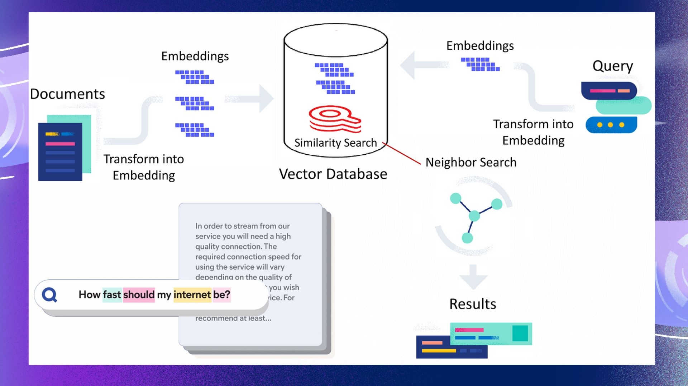

# Chatbot with LangChain and Llama

## Overview
Implementation of a conversational AI chatbot using **LangChain** and the **Llama** language model. The chatbot is designed to provide natural language understanding and context-aware responses, using the power of modern language models.

---

## Features
- **LangChain Framework**: Modular and scalable architecture for conversation workflows.
- **Llama Model**: High-performance language model for accurate and coherent responses.
- **Interactive Chat Interface**: Handles user queries with context-aware responses.



---

## Requirements
- Python 3.x
- Required Libraries:
  - `langchain`
  - `llama`
  - `transformers`
  - `numpy`

Install dependencies using:
```bash
pip install langchain llama transformers numpy
```

---

## How to Use
1. **Load the Notebook**:
   - Open the `SSN_ML_Team_Chatbot_LangChain_with_Llama.ipynb` file in Jupyter Notebook or any compatible environment.
2. **Configure the Model**:
   - Ensure the **Llama** model weights are downloaded and loaded properly. Access through HuggingFace with your access token.
3. **Run the Cells**:
   - Execute the notebook cells sequentially to initialize the chatbot and start an interactive session.

---

## Outputs
- Real-time responses to user queries.
- Context retention for multi-turn conversations.

---

## Future Enhancements
- Add support for multimodal inputs (e.g., images and text).
- Fine-tune the Llama model for domain-specific tasks.
- Enhance response generation with custom knowledge integration.
